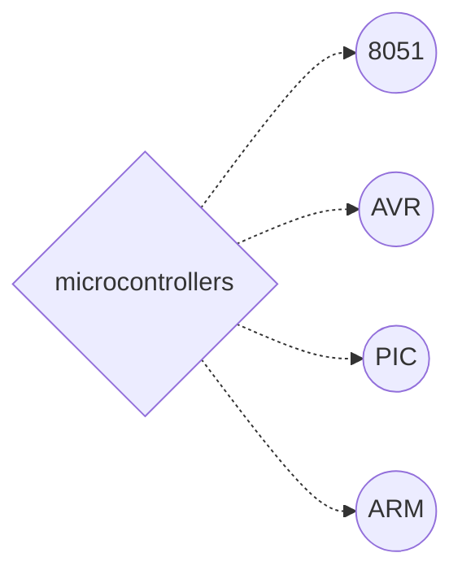
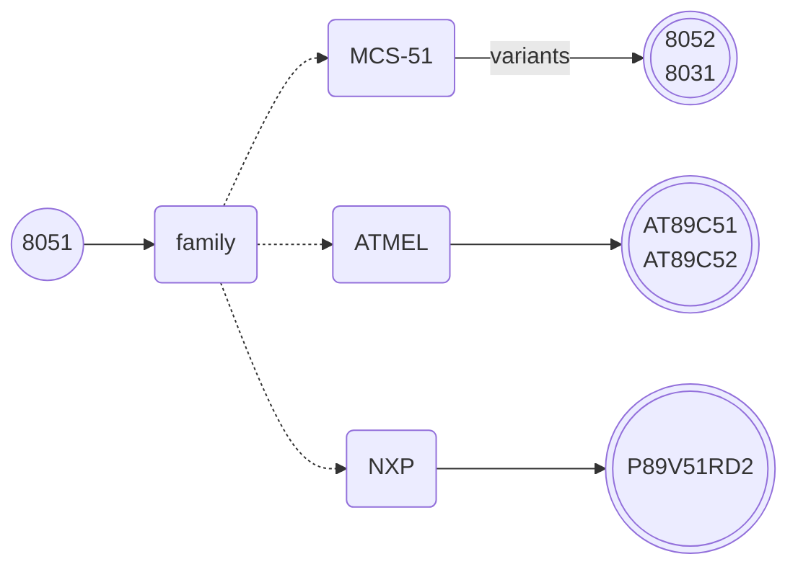
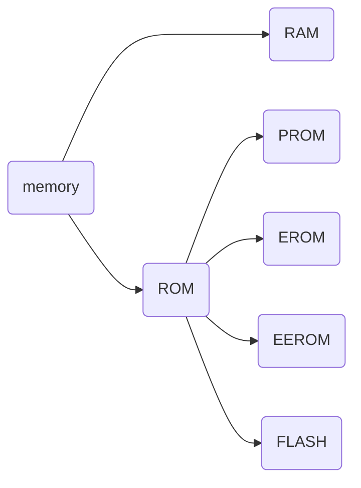
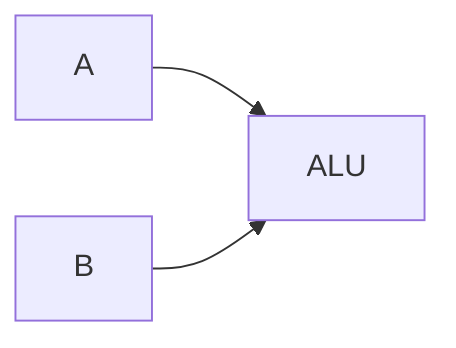
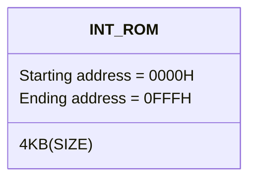
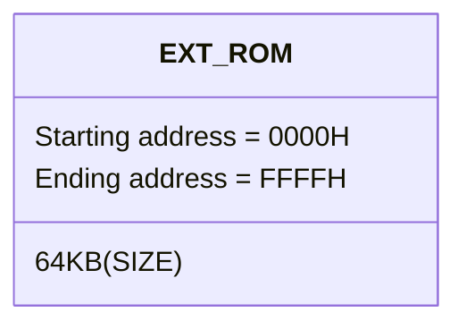
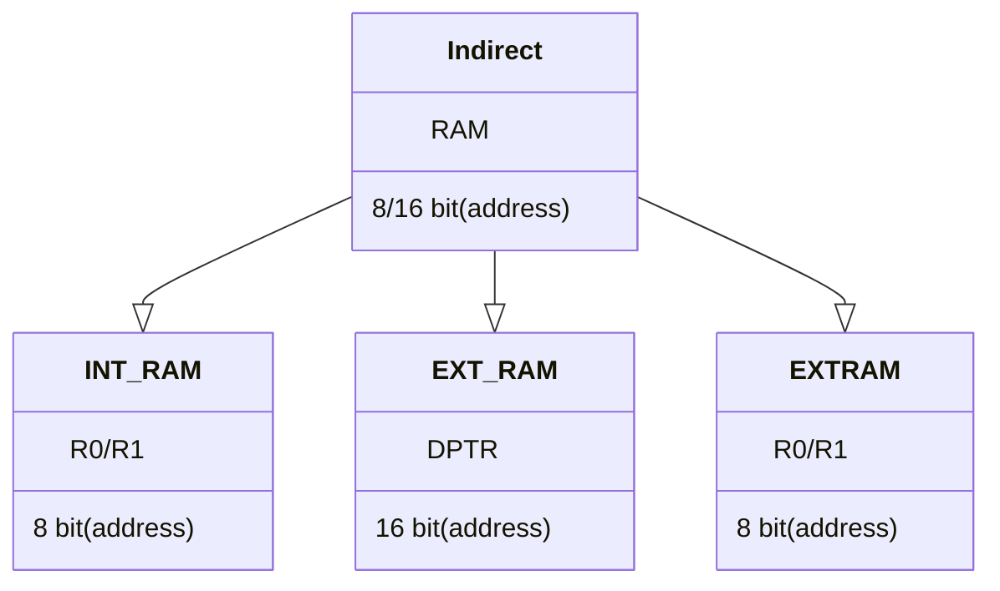

<center>

---
<i><h4>About 8051 Microcontroller  In Embbeded System:</i></h4>

---

<h2><i>Microntroller:</i></h2>
</center>

<em>1. A microcontroller is a small computer chip that contains a processor, memory, and input/output peripherals on a single integrated circuit. 
2. It is designed to perform specific tasks and control devices in embedded systems.</em>
   
---
<center>
 
<h3><i>Types of Microcontrollers:</h3></i>





---
<h3><i>8051 MC:</h3></i>


---
<h5>Let Us See how Memory Stores:</h5>


</center>

---
<h1><center>Memory: </center><h1>
<h6><i>
  Hardware component that stores and retrieves data and instructions is called memory.</h6>

<h3>1.RAM (Random Access Memory):</h3>

1.Volatile memory used for temporary storage.
2.Provides fast access to data.
3.Loses its contents when power is turned off or system is restarted.

<h3>2.ROM (Read-Only Memory):</h3>
1.Non-volatile memory that stores permanent instructions or data.
2.Contents remain even when power is turned off.
3.Contains firmware or software instructions necessary for system boot-up.

<h4><b>a)PROM (Programmable Read-Only Memory):</b></h4>

1.Memory that can be programmed or written to once.
2.Blank when manufactured and programmed using a PROM programmer.
3.Data stored in PROM cannot be changed or erased.

<h4>b)EPROM (Erasable Programmable Read-Only Memory):</h4>

1.Memory that can be erased and reprogrammed multiple times.
2.Erasure requires removal from the computer and exposure to UV light.
3.Reprogramming is done using a PROM programmer.

<h4>c)EEPROM (Electrically Erasable Programmable Read-Only Memory):</h4>

1.Memory that can be erased and reprogrammed electronically.
2.Retains data even when power is turned off.
3.Used in devices where data needs frequent updates or changes, such as BIOS settings or firmware updates.

</i>

---

<h3><i>let us learn about IC's DIP and  PLCC and  TQFP</h2></i>

|IC NAME | DIP | PLCC | TQFP  |
|----------|----------|----------| -------- |
| P89V51RD2FN   |   40  | 44   |  44|
| AT89C51   |   40  | 40   |  44  |
| AT89C52  |   40  | 44    |  44   |
|  AT89C53 |   40  | ---   |  ---  |
|  AT89C2056 |   20  | ---   |  ---  |
|  AT89C4051 |   20  | 20   |  32  |
|  AT89S51 |   20/40  | ---   |  ---  |
|  AT89S53 |   40  | 44   |  44  |
|  AT89S8252 |   40  | 44   |  44  |
|  AT89S8253 |   40  | 44   |  44  |

---

<h2><b>SERIAL COMMUNICATION OF 8051:</h2></b>
<h4>1)UART:</h4>
<i>

a)  **UART** --Universal Asynchronous Reciever and Transmitter
b) **Asynchronous**-- No Clock Signal
|transmitting|recieving|
|------------|---------|
- Unidirection from transmitting to recieving
<h6>WAVEFORM OF UART:</h6>

```wavedrom
{signal:[
  {name:'details',wave:'222.......22',data:' IDEAL ST data(8) stop-1 stop  '},
    {name:'signalling',wave:'10345678941.',data:'D0 D1 D2 D3 D4 D5 D6 D7 '}
],
}
```
- TOTAL = 10bit including 2FRAMES (stop bit,start bit)

<i><h4>2)I2C:</h4>
 a)**I2C**&larr;Inter Integrated Circuit
 b) developed by philips
 c) two signal wires: 
    1.Serial data (SDA)
    2.Serial Clock (SCL)
    d)Synchronous Communication
    e)Bi-Directional data transfer
    </i>

<h3>wide range of bus speeds:</h3>
<i>

|MODE|SPEED|
|----|-----|
|standard mode|100KBps|
|fast mode|400KBps|
|fast mode plus|1MBps|
|high speed mode|3.4MBps|
|ultra fast mode|5MBps|
<h3>waveforms of I2C:</h3>
</i>
```wavedrom
{signal:[
    {name:'SCL',wave:'1.0.1.0.1.0.1.0.1.0',data:' IDEAL ST data(7) PARITY stop-1 stop'},
  {name:'details',wave:'2.2.2..........2.2.',data:' IDEAL START data(8) stop stop'},
    {name:'SDA',wave:'1.0.2.2.2.2.2.0.1..',data:'MSB --- --- ---  LSB'},
   
],
}
```
---

<h4>1) EXAMPLE OF 7BIT DATA WITH PARITY BIT</h4>

   - DATA TO BETRANSMITTED IS LSB TO MSB = 0100 0010
```wavedrom
{signal:[
  {name:'details',wave:'222.......2.2.2.',data:' IDEAL ST data(7) PARITY stop-1 stop'},
    {name:'signalling',wave:'103456789.2.1...',data:'D0 D1 D2 D3 D4 D5 D6 parity '},
    {name:'ASCII=B',wave:'10.10...1.0.1...'},
],
}
```


---
<h1>8051 -MCU</h1>
</i>


- Basic diagram

                 ___________
                |   8bit    |
                |  (MCU)  p0| <==>(P0.0-P0.7)/(AD0-AD7)
        XTAL1-->|         p1| <==>(P1.0-P1.7)/*
        XTAL2-->|         p2| <==>(P2.0-P2.7)/(A15-A8)
        RECET-->|         p3| <==>(P3.0-P3.7)/(alternates is below)
          ALE-->|       p3.0| <--(RX)
          EA'-->|       p3.1| -->(TX)
        PSEN'-->|       p3.2| <--INT0'   
                |       p3.3| <--INT1'
                |       P3.4| <--T0
          VCC-->|       P3.5| <--T1
                |       P3.6| -->WR'
          GND-->|       P3.7| -->RD'
                |___________|

<i>
<h5>8051 MCU contains</h5>

- It is 40-pin IC
- 16-bit address bus
- 8-bit data bus
- 8 pins are address and data multiplexed buses (AD0-AD7)
- And other 8 pins are only address buses(A15-A8)
- 4 ports(P0,P1,P2,P3)

- It contains of internal RAM 128 Bytes.
- It contains of internal ROM 4K Bytes.
</i>
--- 
<i>

|function|explain|
|---|---|
|<h4>VCC:</h4>| This pin provides the power supply voltage to the microcontroller. It is typically connected to a +5V power source.|
|<h4>GND:</h4>|  This pin is the ground reference for the microcontroller. It is connected to the ground of the power supply.|
|<h4>P0.0 - P0.7/AD0 - AD7:</h4> | They can be used for connecting input or output devices, or as address and data lines when interfacing with external memory.|
|<h4>P1.0 - P1.7:</h4>|They can be used for various input or output operations.|
|<h4>P2.0 - P2.7/A15 - A8:</h4>|  Similar to Port 0, they can be used for I/O operations or as address and data lines for external memory interfacing.
|<h4>P3.0 - P3.7/ALT FUN:</h4>|In addition to I/O operations, these pins can also serve as interrupts, timers, or serial communication interfaces.

---
<i><u><h3>ALT FUN:</h3></i></u>

|alt  function|explain|explain
|---|---|---|
|<h4>P3.0 - P3.1(RXD/TXD):</h4>|<h6>RXD:</h6>This pin is the serial data input pin for receiving data in serial communication.|<h6>TXD:<h6> TXD: This pin is the serial data output pin for transmitting data in serial communication.|
<h4>P3.2 - P3.3(<SPAN STYLE="text-decoration:overline">INT0</SPAN>,<SPAN STYLE="text-decoration:overline">INT1</SPAN>):<h4>|INT-0: It can be configured to generate an interrupt signal when a specific event occurs externally.  This pin is the external interrupt 1 input pin. | INT-1:  Similar to INT0, it can be configured to generate an interrupt signal in response to an external event.|
|<h4>P3.4 - P3.5(T0/T1):<h4>|T0: It can be used to trigger or count external events for Timer 0 operations.|T1: It can be used for triggering or counting external events related to Timer 1 operations.|
|<h4>P3.6 - P3.7(<SPAN STYLE="text-decoration:overline">WR</SPAN>,<SPAN STYLE="text-decoration:overline">RD</SPAN>):|<SPAN STYLE="text-decoration:overline">WR</SPAN>:</h4>  It indicates a write operation to external memory.|<SPAN STYLE="text-decoration:overline">RD</SPAN>: It indicates a read operation from external memory.

---
|FUNCATIONS|EXPLAIN|
|----|----|
|<h4>XTAL1:</h4>|This pin is used to connect an external crystal oscillator or resonator for generating the clock signal required by the microcontroller.
|<h4>XTAL2:</h4> |This pin provides the output of the external crystal oscillator or resonator|.
|<h4>RST:</h4> |T When a reset signal is applied to this pin, the microcontroller is initialized and its program execution restarts from the reset vector.|
|<h4>ALE:</h4>| It indicates the availability of a valid address on the address bus during external memory operations.|
|<h4><SPAN STYLE="text-decoration:overline">EA</SPAN>/VPP:</h4>|TIt can be used to select either the internal program memory or external program memory for the microcontroller.
|<h4>PSEN':</h4>| The Program Store Enable signal is used for external memory interfacing.|

</i>

---

<h2><center>ARCHITECTURE OF 8051</h2></center>


<h5>1.ALU:</h5>

* ALU performs arithmetic like addition, subtraction, multiplication and Logical Operations like NAND, NOR etc.
*  Since 8051 is an 8 bit microcontroller, it takes input from two 8 bit registers namely A and B and processes them.

<i>

* the main fuction of the *A* - register is _*accumilating the series data of data and store the result of the data*_.
* the main function of the *B* - register is _*used is in multiplication and division oprationes*_.
<h5>2.PSW(Progarm Status Word):</h5>

* 'PSW' indicates various flags associated with the operation performed.
<h5>3.PC(Program Counter):</h5>

*  The program counter is a 16-bit register that holds the address of the next instruction to be fetched and executed.
<h5>4.DPTR(Data Pointer):</h5>

*  It gives the address of the data.
*  It can be changed by the programmer(DPH/DPL).
  
<h4>5.About RAM And ROM</h4>

|Fuction| Internal RAM |Internal ROM | External RAM | Extarnal ROM |
|-|----------|----------|----------|----------|
|size| 128bytes   | 4kbytes    | 64kbytes    | 64kbytes    |
|start address| 00H   | 0000H  | 0000H    | 0000H    |
|ending address| 7FH   | 0FFFH| FFFFH    | FFFFH    |
|address bit| 7-bit    | 12-bit  | 16-bit   | 16-bit   |
|show  as | 8-bit   | 16-bit    | 16-bit    | 16-bit  |

</i>

<h5><i>6.Latch:</h5>

* A latch is a sequential logic circuit that stores a single bit of data. It is a type of flip-flop and is commonly used for temporary storage or as a building block for more complex circuits.
<h5>7.Timing and control CKT:</h5>

* It releases the control signals.
</i>

---
<i>
<center><h4>Program Status Word: (bit addresable):</h4></center>

|  CY  |  AC  |  FO  |  RS1  |  RS0  |  OVR  |  X  |  P  |
|---|---|---|---|---|---|---|---|
| PSW.7|PSW.6|PSW.5|PSW.4|PSW.3|PSW.2|PSW.1|PSW.0|
<h5>CY-Carry Flag:</h5>

   CY=1&rarr;carry out of msb
   CY=0&rarr;no carry

<h5>EXAMPLE:</h5>

|| 11H | 1111 1111 |
|-|-|-|
|+|01H|0000 0001|
||100H|0000 0000|

</i>

<h5>AC-Auxilary Flag:</h5><i>

  AC=1&rarr;if carry adds from lower to upper nibble
  AC=0&rarr;no auxilary flag

|   | 11H | 1111 1111 |
|-|-|-|
|+|01H|0000 0001|
||100H|0000 0000|
 
<h5>FO:(User Defined Flag)</h5>

  user decides the flag value
  ex: SETB PSW.5
<h5>RS1/RS0:</h5>

* register bank select
* 8051 hs 32 bytes  of register
 
 |MODE|BANK|                         
 |---|---|                          
 |00|bank-0|
 |01|bank-1|
 |10|bank-2|
 |11|bank-3|
<h5>Parity Bit:</h5>

* p=1&rarr;odd parity
* p=0&rarr;even parity
<h5>OVR:(over flow)</h5>

* ovr=1&rarr;overflow occured 
 
* ovr=0&rarr;no overflow

---
<center><h3>8051 Memory Oraganisation:</h3></center>

 <u> **PROGRAMMER CODE MEMORY:**  </u>

####1.ONLY INTERNAL RAM:(4KB)

####2. INT + EXT:(4KB+64KB)

&nbsp;&nbsp;&nbsp;&nbsp;&nbsp;&nbsp;&nbsp;&nbsp;&nbsp;&nbsp;&nbsp;&nbsp;&nbsp;&nbsp;&nbsp;&nbsp;&nbsp;&nbsp;&nbsp;&nbsp; &darr;

* 1.Any address less then 1000H it takes INT ROM
* 2.Any adddress greater than 1000H it takes EXT ROM
####3.ONLY EXT:(64kb)



---
<center><h3>STRUCTURE OF INT RAM:</center>

|Address|bytes|modes|
|---|---|---|
|30H-7FH|80Bytes|General Purpopse RAM|
|20H-2FH|16Bytes|Bit Adderesable Area|
|18H-1FH|8Bytes|(R0...R7) BANK-3|
|10H-17H|8Bytes|(R7-R0) BANK-2|
|08H-OFH|8Bytes|(R7-R0)bank-1|
|00H-07H|8Bytes|(R7-R0)BANK-0|


* 1. we can access bank either by address or name.
* 2. In 16 bytes we can do bit operation and byte operation individually.

---
<h3><center>STACK POINTER</h3></center>

* Stack is present in internal RAM.
* SP is a 8 bit register.

| PUSH | Operation                |
|-------------|--------------------------|
|SP|&larr;SP+1
| PUSH        | Pushes data onto the stack|


| POP | Operation                |
|-------------|--------------------------|
| POP        | Pops data from the stack|
|SP|&larr;SP-1|


* The default value address of SP is 07H(from structure of INT RAM).
* Here when the data is push the SP is incremented and the first data is stored in the 08H address.

>1. Initially, the stack is empty, and the SP points to the default value address:
>-   SP = 07H
>2. When the first data is pushed onto the stack, the SP is incremented, and the data is stored in the next address (08H):
>+   SP = 08H
>+   08H: \<first data>
>3. If another data value is pushed onto the stack:
>+   SP = 09H
>+   09H: \<second data>
>+   08H: \<first data>
>4. And if a third data value is pushed onto the stack:
>+   SP = 0AH
>+   0AH: \<third data>
>+   09H: \<second data>
>+   08H: \<first data>

---

<h3><center>SFR: (Special Function Registers)</h3></center>

* 1.There are 21 SFR'S.
* 2. It's a 8bit register.


#####Byte addresable:
* The bytes are alloted bit address at a range of 80H to FFH in RAM.
* Example:
 MOV A,TCON
 MOV A,80

#####Bit addresable:
* The bits are alloted bit address at a range of 80H to FFH in bit adderesable area.
* Example:
* SETB P0.0
*  CLR P0.0
---

<u><h3><CENTER>8051 Addressing Modes: </h3></CENTER></u>


|#|represents data|
|--|--|

|MOVX|EXT RAM|
|--|--|

|MOVC|EXT ROM|
|--|--|


<h4>1.IMMEDIATE: </h4>

* Data is given in instruction itself.

|Examples|explaination|
|-|-|
|<li>MOV A,#25H | (A &larr; 25)|
|<li>MOV DPTR,#2000H | (DPTR &larr; 2000)|


<h4>2.REGISTER:</h4>

* Data is present in registers.

| Examples| explaination|
|-|-|
|<li>MOV A,R0 | (A &larr; R0)|
|<li>MOV R1,A | (R1 &larr; A)|

>* **MOV R1,R0** (we cannot use two registers to move data)

<h4> 3.Direct: </h4>

* Giving address in instruction.
* only for intenal RAM  and SFR

| Examples |explaination|
|-|-|
|<li>MOV A,25H | (A &larr; [25])|
|<li>MOV 30H,A | ([30] &larr; A)|
 
<H4>4.Indirect:</h4>

* Giving address in register.

<i>



</i>

 |RAM|examples|bits|
|-|-|-|
|INT RAM<br>(R0/R1)|MOV A,@R0 ; (A&larr; [R0])<br>MOV @R0,A ; ([R0]&larr; A)|8bit|
|EXT RAM<BR>(DPTR)|MOVX A,@DPTR ; (A&larr;[DPTR]^)<br>MOVX @DPTR,A ; ([DPTR]^ &larr; A)|16 bit|
|EXT RAM<BR>(R0/R1)|MOVX A,@R0 ; (A &larr; [R0]^)<br>MOVX @R0,A ; ([R0]^&larr;A)|8 bit|

<h4>Indexed: </h4>

* Only for ROM.
* Address is given as sum of two registers.

| Examples| explaination|
|-|-|
|<li>MOV A,@A + DPTR | (A &larr;([A] + DPTR))|
|<li>MOV A,@A + PC| (A &larr; ([A] + PC))|

* The static data is stored in ROM.
* Data is stored in ROM in **look up table**.
<table>
  <tr>
    <td colspan=2> <center><h5>Look up table (7-segment codes)</center></td>
  </tr>
  <tr>
    <td>0400</td>
    <td>0'</td>
  </tr>
  <tr>
    <td>0401</td>
    <td>1'</td>
  </tr>
  <tr>
    <td>.</td>
    <td>.</td>
  </tr>
  <tr>
    <td>.</td>
    <td>.</td>
  </tr>
  <tr>
    <td>.</td>
    <td>.</td>
  </tr>
  <tr>
    <td>0400+5</td>
    <td>5'</td>
  </tr>
  <tr>
    <td>.</td>
    <td>.</td>
  </tr>
  <tr>
    <td>.</td>
    <td>.</td>
  </tr>
  <tr>
    <td>.</td>
    <td>.</td>
  </tr>
  <tr>
    <td>0409</td>
    <td>9'</td>
  </tr>
</table>

>*  **To get the code of 5:**
MOV DPTR,#0400H ; DPTR = 0400
MOV A,#05H ; A = 05
MOVC A,@A + DPTR ; A &larr; [A]+DPTR

>*  **To get the code of 7:**
MOV DPTR , #0400H ; DPTR = 0400
MOV A , #07H ; A = 07
MOVC A , @A + DPTR ; A &larr; [A]+DPTR


---

<i>

<u><h3><center>ARITHMETIC GROUP INTRUCTIONS:</h3></center></u>


  <h4>1.ADD INSTRUCTION:</h4>
  
|OPCODE|SOURCE|DESTINATION|EXPLANATION|
|----|---|---|---|
|ADD| A|#25H| A&larr;25|
|ADD |A|25H|A&larr;[25]|
|ADD |A|@R0| A&larr;A+[R0]|


|OPCODE|SOURCE|DESTINATION|EXPLANATION|
|----|---|---|---|
 |ADDC| A|#25| A&larr;A+25H+C
 |ADDC |A| 25H|A&larr;[25]|
 |ADDC |A|@R0| A&larr;A+[R0]|
 |ADDC |A|R0|A&larr;[R0]


<h4> 2.SUB INSTRUCTION:</h4>

|OPCODE|SOURCE|DESTINATION|EXPLANATION|
|----|---|---|---| 
|SUBB|A|#25|A&larr;A-25H-CF
|SUBB|A|R0|A&larr;[R0]|
|SUBB|A|05H|A&larr;[05]
|SUBB|A|@R0|A&larr;A+[R0]

<h4> 3. INC INSTRUCTION:</h4>

 |OPCODE|SOURCE|EXPLANATION|
 |----|---|---|
 |INC|A|A+1|
 |INC|R0|[R0+1]
 |INC|DPTR|[DPTR+1]
 |INC|@R0|A+[R0]+1|

  <h4>4. DEC INSTRUCTION:</h4>
  
  |OPCODE|SOURCE|EXPLANATION|
 |----|---|---|
 |DEC|A|A-1|
 |DEC|R0|[R0-1]
 |DEC|DPTR|[DPTR-1]
 |DEC|@R0|A+[R0]-1|

  <h4>5. MUL:</h4>

|B.A|&larr;|A*B|
|---|--|---|
B = HIGHER
A = LOWER 

  <h4>6.DIV AB:</h4>
 
 |B.A|&larr;|A/B|
 |---|---|---|
 DIV  BY O = OVERFLOW WILL NE SET\

 <h4> 7.DAA(DECIMAL ADJUST AFTER ADDITION)</h4>

- If lower nibble is greater than 9  OR if AC = 1
  + then ADD 06h
  
- If higher nibble is greater than 9 OR CF = 1
   + then ADD 60H
  
  </i>

---

<H3><CENTER>LOGICAL INSTRUCTIONS</CENTER></H3>

  <H4>1.AND INSTRUCTION</H4>

|OPCODE|SOURCE|DESTINATION|EXPLANATION|
|----|---|---|---|
 |ANL| A|#25| A&larr;A+25H+C
 |ANL |A| 25H|A&larr;[25]|
 |ANL |A|@R0| A&larr;A+[R0]|
 |ANL |A|R0|A&larr;[R0]
|ANL|25H|A|A&larr;[25]
|ANL|25H|#25|[25]&larr;25

 <H4>2.OR INSTRUCTION</H4>

|OPCODE|SOURCE|DESTINATION|EXPLANATION|
|----|---|---|---|
 |ORL| A|#25| A&larr;A+25H+C
 |ORL |A| 25H|A&larr;[25]|
 |ORL |A|@R0| A&larr;A+[R0]|
 |ORL |A|R0|A&larr;[R0]
|ORL|25H|A|A&larr;[25]
|ORL|25H|#25|[25]&larr;25

 <H4>3.XOR INSTRUCTION</H4>

 |OPCODE|SOURCE|DESTINATION|EXPLANATION|
|----|---|---|---|
 |XOR| A|#25| A&larr;A+25H+C
 |XOR |A| 25H|A&larr;[25]|
 |XOR |A|@R0| A&larr;A+[R0]|
 |XOR |A|R0|A&larr;[R0]
|XOR|25H|A|A&larr;[25]
|XOR|25H|#25|[25]&larr;25 


  <H4>4.CLR A:</H4>

 * A&larr;00H

  <H4>5.CPL A:</H4>

 * A&larr;<SPAN STYLE="text-decoration:overline">A

  <H4>6.SWAP A:</H4>

 * A LN &harr;A HN
  
 <H4>6.NOP A:</H4> 

* NOP (NO OPERATION)
* 1 MICROSECOND DELAY


  </I>

<H4>7.RL A:</H4>

<i>

|0|&larr;|1|0|0|0|1|0|0|
|----|---|---|---|---|---|---|--|---|
AFTER RLA
|1|&larr;|0|0|0|1|0|0|1|
|----|---|---|---|---|---|---|--|---|
   <H4>8.RLC A:</H4>

 |0|&larr;|1|0|0|0|1|0|0|
|----|---|---|---|---|---|---|--|---|  
AFTER RLC
|1|&larr;|0|0|0|1|0|0|0|
|----|---|---|---|---|---|---|--|---|

   <H4>9.RR A:</H4>
 
|0|0|0|1|0|0|1|&rarr;|0
|----|---|---|---|---|---|---|--|---|
AFTER RRA
|0|0|0|0|1|0|0|&rarr;|1
|----|---|---|---|---|---|---|--|---|

  <H4>10.RR C:</H4>
 
|0|0|0|1|0|0|1|&rarr;|0
|----|---|---|---|---|---|---|--|---|
AFTER RRA
|0|0|0|0|1|0|0|&rarr;|1
|----|---|---|---|---|---|---|--|---|

---

<h3><center>BOOLEAN INSTRUCTIONS:</CENTER></H3>

<H4>1.CARRY FLAG:</H4>

|function|flag|
|---|---|---|
|SETB| C
|CLR |C
|CPL| C

<H4>2.ANY GENERAL BIT:</H4>

|function|flag|
|---|---|---|
|SETB| B
|CLR |B
|CPL| B

<H4>3.MOV:</H4>

|OPERAND|SOURCE|DATA|EXPLAINATION|
|---|---|---|---|
|MOV|C|P0.3|C &larr; P0.3
|MOV|P0.3|C|P0.3 &larr; C

---


